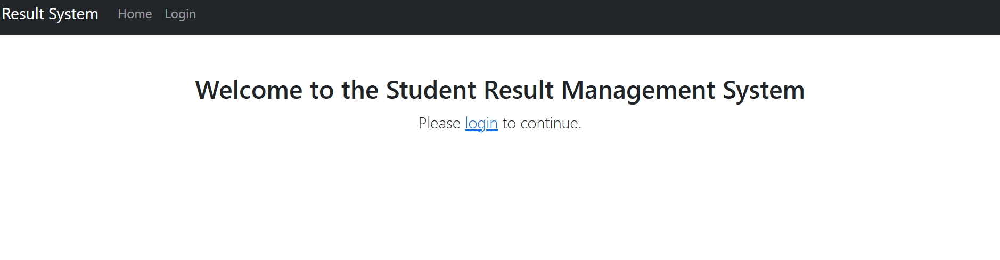
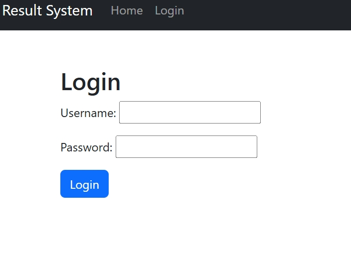
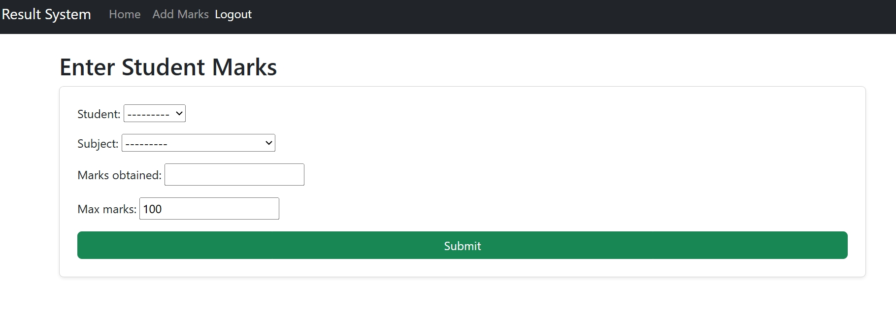
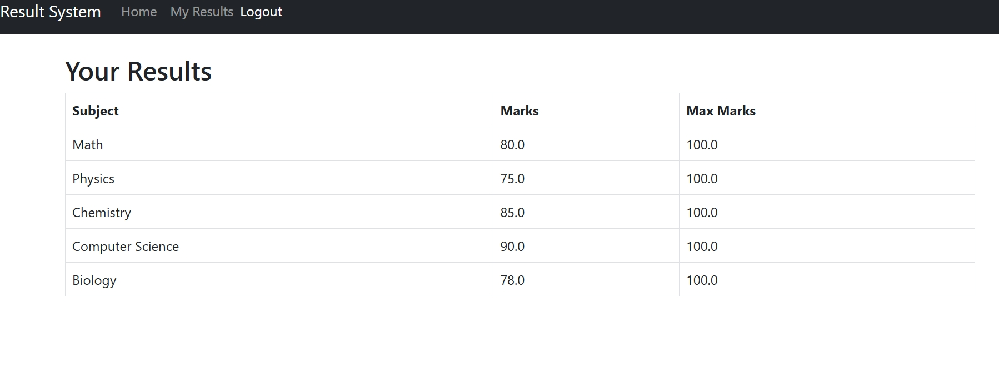

# Student Result Management System
A Django-based web application to manage and view student results. This project features role-based access for admins, teachers, and students, with secure authentication and a responsive Bootstrap UI.

# Features
Role-based login:
- **Admin**: Full access via Django admin panel  
- **Teacher**: Add student marks  
- **Student**: View personal results

Clean Bootstrap-based UI with dynamic navbar
Secure login/logout system (POST logout, CSRF-protected)
Modular app structure (students app for core logic)
SQLite3 database with Django ORM

# Technologies Used
- Python 3
- Django 5.2
- SQLite3 (default database)
- HTML/CSS with Bootstrap 5
- Git + GitHub for version control

# Folder Structure
student-result-management/
├── students/ # App logic
│ ├── models.py
│ ├── views.py
│ ├── forms.py
│ └── templates/
├── templates/ # Global templates (base.html)
├── result_portal/ # Project settings
├── db.sqlite3
└── manage.py

## 🛠️ Setup Instructions
1. Clone the repo  
2. Create a virtual environment and activate it  
3. Install dependencies: `pip install -r requirements.txt`  
4. Apply migrations and run the server:
```bash
python manage.py migrate
python manage.py runserver

# Screenshots
# Home Page

# Login Page

# Add Marks (Teacher)

### My Results (Student)


